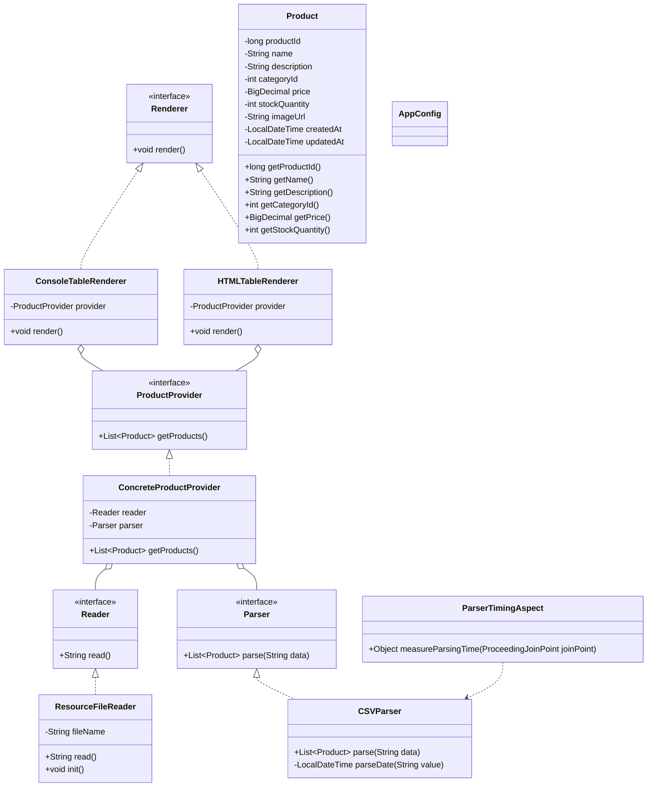

# Лабораторная работа 2. Конфигурирование приложения Spring с помощью аннотаций. AOP


## Цель работы 
Переделать приложение из лабораторной работы №1 на конфигурирование с помощью аннотаций Spring, добавить вывод таблицы в HTML-файл и реализовать измерение времени парсинга CSV-файла с помощью AOP.

## Выполнение работы
В начале работы результат лабораторной работы №1 был скопирован в директорию:
```text
les04/lab
```
Далее приложение было переделано на конфигурирование с помощью аннотаций. Вместо ручного создания бинов через методы @Bean были использованы аннотации @Component.

В конфигурационный класс AppConfig были добавлены аннотации:
```
@Configuration
@ComponentScan(basePackages = "ru.bsuedu.cad.lab")
@PropertySource("classpath:application.properties")
@EnableAspectJAutoProxy
```
Файл application.properties был создан в директории:
```
app/src/main/resources/application.properties
```
В классе ResourceFileReader имя файла внедряется через аннотацию @Value.

Также в ResourceFileReader был добавлен метод с аннотацией @PostConstruct, который выводит дату и время полной инициализации бина.

Была создана новая реализация интерфейса Renderer — класс HTMLTableRenderer. Он формирует HTML-таблицу с товарами и сохраняет её в файл:
```
products.html
```
Чтобы Spring выбирал именно HTMLTableRenderer, была использована аннотация @Primary.

Для измерения времени парсинга CSV-файла был создан аспект ParserTimingAspect. Он перехватывает выполнение метода CSVParser.parse(...) и выводит время выполнения в миллисекундах.

## UML-диаграмма Mermaid



## Выводы
В ходе лабораторной работы приложение было переделано на конфигурирование с помощью аннотаций Spring. Было реализовано чтение имени файла из application.properties, добавлена новая HTML-реализация вывода таблицы, использован жизненный цикл бина через @PostConstruct, а также применён AOP для измерения времени парсинга CSV-файла.