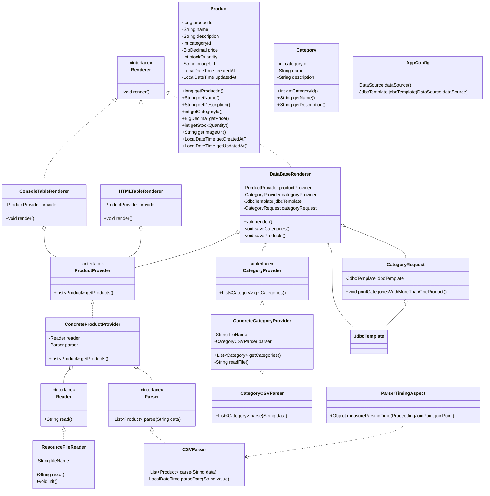

# Лабораторная работа 3. Технологии работы с базами данных. JDBC

## Цель работы

Научить приложение сохранять данные в базу данных с использованием JDBC, а также выполнять SQL-запросы и выводить результаты в консоль через логирование.

В работе используется встроенная база данных H2, а также инструменты Spring JDBC: `DataSource`, `JdbcTemplate` и SQL-скрипт для создания таблиц.

## Выполнение работы

В начале работы результат лабораторной работы №2 был скопирован в директорию:

```text
les06/lab
```

Далее в проект были добавлены зависимости для работы с базой данных и логированием:

```kotlin
implementation("org.springframework:spring-jdbc:6.2.2")
implementation("com.h2database:h2:2.2.224")
implementation("ch.qos.logback:logback-classic:1.5.6")
```

## Создание базы данных

Для работы с базой данных была использована встроенная база данных H2.

В конфигурационном классе `AppConfig` был создан бин `DataSource` с помощью `EmbeddedDatabaseBuilder`.

```java
@Bean
public DataSource dataSource() {
    return new EmbeddedDatabaseBuilder()
            .setType(EmbeddedDatabaseType.H2)
            .addScript("classpath:schema.sql")
            .build();
}
```

Также был создан бин `JdbcTemplate`:

```java
@Bean
public JdbcTemplate jdbcTemplate(DataSource dataSource) {
    return new JdbcTemplate(dataSource);
}
```

`JdbcTemplate` используется для выполнения SQL-запросов к базе данных.

## SQL-скрипт

В директории ресурсов был создан файл:

```text
app/src/main/resources/schema.sql
```

В нём создаются две таблицы:

- `CATEGORIES`
- `PRODUCTS`

Таблица `PRODUCTS` связана с таблицей `CATEGORIES` с помощью внешнего ключа `category_id`.

```sql
CREATE TABLE CATEGORIES (
    category_id INT PRIMARY KEY,
    name VARCHAR(255) NOT NULL,
    description VARCHAR(1000)
);

CREATE TABLE PRODUCTS (
    product_id INT PRIMARY KEY,
    name VARCHAR(255) NOT NULL,
    description VARCHAR(1000),
    category_id INT NOT NULL,
    price DECIMAL(10, 2),
    stock_quantity INT,
    image_url VARCHAR(1000),
    created_at TIMESTAMP,
    updated_at TIMESTAMP,

    CONSTRAINT fk_products_categories
        FOREIGN KEY (category_id)
        REFERENCES CATEGORIES(category_id)
);
```

Скрипт выполняется автоматически при старте приложения.

## Работа с категориями

Для таблицы `CATEGORIES` был создан класс `Category`.

Он содержит поля:

- `categoryId`
- `name`
- `description`

Также были добавлены классы для чтения категорий из CSV-файла:

- `CategoryProvider`
- `ConcreteCategoryProvider`
- `CategoryCSVParser`

Файл с категориями расположен по пути:

```text
app/src/main/resources/category.csv
```

Имя файла указывается в `application.properties`:

```properties
category.file.name=category.csv
```

## Сохранение данных в базу

Для сохранения данных в базу данных была создана новая реализация интерфейса `Renderer`:

```text
DataBaseRenderer
```

Этот класс используется по умолчанию с помощью аннотации `@Primary`.

`DataBaseRenderer` выполняет следующие действия:

1. Получает список категорий из `CategoryProvider`.
2. Сохраняет категории в таблицу `CATEGORIES`.
3. Получает список товаров из `ProductProvider`.
4. Сохраняет товары в таблицу `PRODUCTS`.
5. Выводит сообщение об успешном сохранении данных.

Сначала сохраняются категории, а потом товары, потому что таблица `PRODUCTS` содержит внешний ключ на таблицу `CATEGORIES`.

## SQL-запрос к базе данных

Для выполнения запроса к базе данных был создан класс:

```text
CategoryRequest
```

Он выполняет SQL-запрос, который получает список категорий, где количество товаров больше одного.

```sql
SELECT c.name, COUNT(p.product_id) AS product_count
FROM CATEGORIES c
JOIN PRODUCTS p ON c.category_id = p.category_id
GROUP BY c.category_id, c.name
HAVING COUNT(p.product_id) > 1
```

Результат запроса выводится в консоль через logback на уровне `INFO`.

Пример вывода:

```text
INFO r.b.cad.lab.request.CategoryRequest - Category: Средства ухода, product count: 2
```

## Логирование

Для настройки логирования был создан файл:

```text
app/src/main/resources/logback.xml
```

В нём отключены лишние debug-сообщения Spring и оставлен уровень логирования `INFO`.

```xml
<configuration>
    <appender name="CONSOLE" class="ch.qos.logback.core.ConsoleAppender">
        <encoder>
            <pattern>%d{HH:mm:ss} %-5level %logger{36} - %msg%n</pattern>
        </encoder>
    </appender>

    <logger name="org.springframework" level="WARN"/>

    <root level="INFO">
        <appender-ref ref="CONSOLE"/>
    </root>
</configuration>
```


## Структура проекта

Основной код приложения расположен по пути:

```text
app/src/main/java/ru/bsuedu/cad/lab
```

Основные пакеты:

```text
config   - конфигурация Spring
model    - классы Product и Category
parser   - парсеры CSV-файлов
provider - поставщики данных из CSV
renderer - вывод и сохранение данных
request  - SQL-запросы к базе данных
aspect   - AOP-логика для измерения времени парсинга
```

## UML-диаграмма классов



## Вывод

В ходе лабораторной работы приложение было дополнено работой с базой данных через Spring JDBC.

Была подключена встроенная база данных H2, созданы таблицы `CATEGORIES` и `PRODUCTS`, реализовано сохранение данных из CSV-файлов в базу данных, а также выполнен SQL-запрос с выводом результата через logback на уровне `INFO`.

В работе были использованы `DataSource`, `EmbeddedDatabaseBuilder`, `JdbcTemplate`, SQL-скрипт `schema.sql` и логирование через logback.