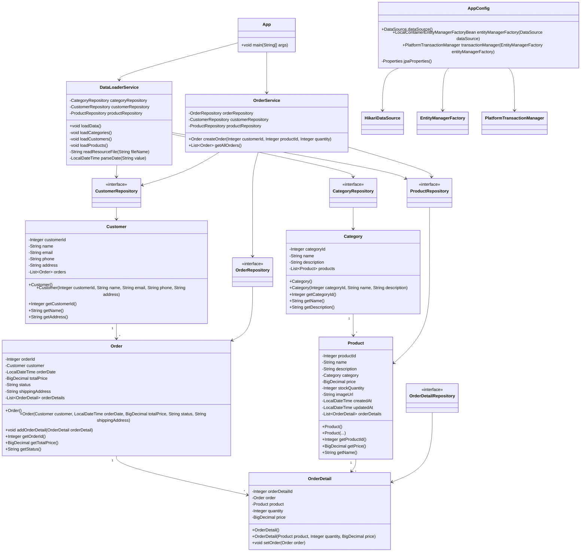

# Лабораторная работа 4. Технологии работы с базами данных. JPA. Spring Data

## Цель работы

Выполнить рефакторинг приложения магазина зоотоваров и перейти от работы с базой данных через JDBC к использованию JPA, Hibernate и Spring Data JPA.

В лабораторной работе также необходимо привести проект к слоистой архитектуре, создать JPA-сущности, репозитории, сервисы и реализовать создание заказа в рамках транзакции.

## Выполнение работы

В начале работы результат лабораторной работы №3 был скопирован в директорию:

```text
les08/lab
```

После этого проект был переработан под использование JPA, Hibernate и Spring Data JPA.

Старые пакеты из предыдущих лабораторных работ были удалены, так как приложение было приведено к новой слоистой архитектуре.

## Структура проекта

Основной код приложения расположен по пути:

```text
app/src/main/java/ru/bsuedu/cad/lab
```

Структура пакетов:

```text
ru.bsuedu.cad.lab
├── app
├── config
├── entity
├── repository
└── service
```

Назначение пакетов:

```text
app        - точка входа в приложение
config     - конфигурация Spring, JPA, Hibernate и DataSource
entity     - JPA-сущности
repository - Spring Data JPA репозитории
service    - сервисы с логикой приложения
```

## Настройка DataSource и Hibernate

Для подключения к базе данных используется встроенная база данных H2.

В качестве реализации `DataSource` используется `HikariDataSource`, как требуется в задании.

Конфигурация расположена в классе:

```text
ru.bsuedu.cad.lab.config.AppConfig
```

В классе `AppConfig` создаётся бин `DataSource`:

```java
@Bean
public DataSource dataSource() {
    HikariDataSource dataSource = new HikariDataSource();

    dataSource.setJdbcUrl("jdbc:h2:mem:petshop;DB_CLOSE_DELAY=-1");
    dataSource.setUsername("sa");
    dataSource.setPassword("");
    dataSource.setDriverClassName("org.h2.Driver");

    return dataSource;
}
```

Также в конфигурации создаются:

- `EntityManagerFactory`;
- `PlatformTransactionManager`;
- настройки Hibernate.

Для автоматического создания схемы базы данных используется настройка:

```java
properties.setProperty("hibernate.hbm2ddl.auto", "create");
```

Это означает, что Hibernate создаёт таблицы автоматически на основании JPA-сущностей.

## JPA-сущности

В пакете:

```text
ru.bsuedu.cad.lab.entity
```

были созданы JPA-сущности:

```text
Category
Product
Customer
Order
OrderDetail
```

Эти классы соответствуют таблицам базы данных:

```text
CATEGORIES
PRODUCTS
CUSTOMERS
ORDERS
ORDER_DETAILS
```

Для обозначения сущностей используются аннотации:

```java
@Entity
@Table(name = "...")
```

Первичный ключ задаётся с помощью:

```java
@Id
```

Для автоматически создаваемых идентификаторов используется:

```java
@GeneratedValue(strategy = GenerationType.IDENTITY)
```

## Связи между сущностями

В проекте были реализованы связи между сущностями:

```text
Category 1 → много Product
Customer 1 → много Order
Order 1 → много OrderDetail
Product 1 → много OrderDetail
```

В коде используются аннотации JPA:

```java
@OneToMany
@ManyToOne
@JoinColumn
```

Например, у товара есть связь с категорией:

```java
@ManyToOne
@JoinColumn(name = "category_id")
private Category category;
```

Это означает, что каждый товар относится к одной категории.

## Репозитории

В пакете:

```text
ru.bsuedu.cad.lab.repository
```

были созданы Spring Data JPA репозитории:

```text
CategoryRepository
ProductRepository
CustomerRepository
OrderRepository
OrderDetailRepository
```

## Загрузка начальных данных

Для заполнения базы данных начальными данными был создан сервис:

```text
DataLoaderService
```

Он находится в пакете:

```text
ru.bsuedu.cad.lab.service
```

Сервис загружает данные из CSV-файлов:

```text
category.csv
customer.csv
product.csv
```

Файлы расположены в директории:

```text
app/src/main/resources
```

`DataLoaderService` выполняет следующие действия:

1. Читает `category.csv`.
2. Создаёт объекты `Category`.
3. Сохраняет категории через `CategoryRepository`.
4. Читает `customer.csv`.
5. Создаёт объекты `Customer`.
6. Сохраняет покупателей через `CustomerRepository`.
7. Читает `product.csv`.
8. Находит категорию для каждого товара.
9. Создаёт объекты `Product`.
10. Сохраняет товары через `ProductRepository`.

Загрузка данных выполняется в транзакции с помощью аннотации:

```java
@Transactional
```

## Создание заказа

Для создания заказа был реализован сервис:

```text
OrderService
```

Он содержит методы:

```java
createOrder(Integer customerId, Integer productId, Integer quantity)
getAllOrders()
```

Метод `createOrder()` создаёт новый заказ:

1. Находит покупателя по `customerId`.
2. Находит товар по `productId`.
3. Считает итоговую стоимость заказа.
4. Создаёт объект `Order`.
5. Создаёт объект `OrderDetail`.
6. Связывает `Order` и `OrderDetail`.
7. Сохраняет заказ через `OrderRepository`.

Создание заказа выполняется в рамках транзакции:

```java
@Transactional
public Order createOrder(Integer customerId, Integer productId, Integer quantity) {
    ...
}
```

Это нужно для того, чтобы заказ и его детали сохранялись как одна операция.

## Клиент приложения

Клиент приложения находится в классе:

```text
ru.bsuedu.cad.lab.app.App
```

При запуске приложение выполняет следующие действия:

1. Создаёт Spring-контекст.
2. Получает `DataLoaderService`.
3. Получает `OrderService`.
4. Загружает начальные данные из CSV.
5. Создаёт новый заказ.
6. Получает список всех заказов.
7. Выводит информацию в лог.

Для логирования используется `logback`.

## UML-диаграмма классов




## Вывод

В ходе лабораторной работы приложение было переведено с JDBC на JPA, Hibernate и Spring Data JPA.

Была настроена встроенная база данных H2 через `HikariDataSource`, создана JPA-конфигурация, реализованы сущности, репозитории и сервисы.

Также был создан сервис для загрузки данных из CSV-файлов и сервис для создания заказа. Создание заказа выполняется в рамках транзакции. Результат работы приложения выводится в консоль через логирование.