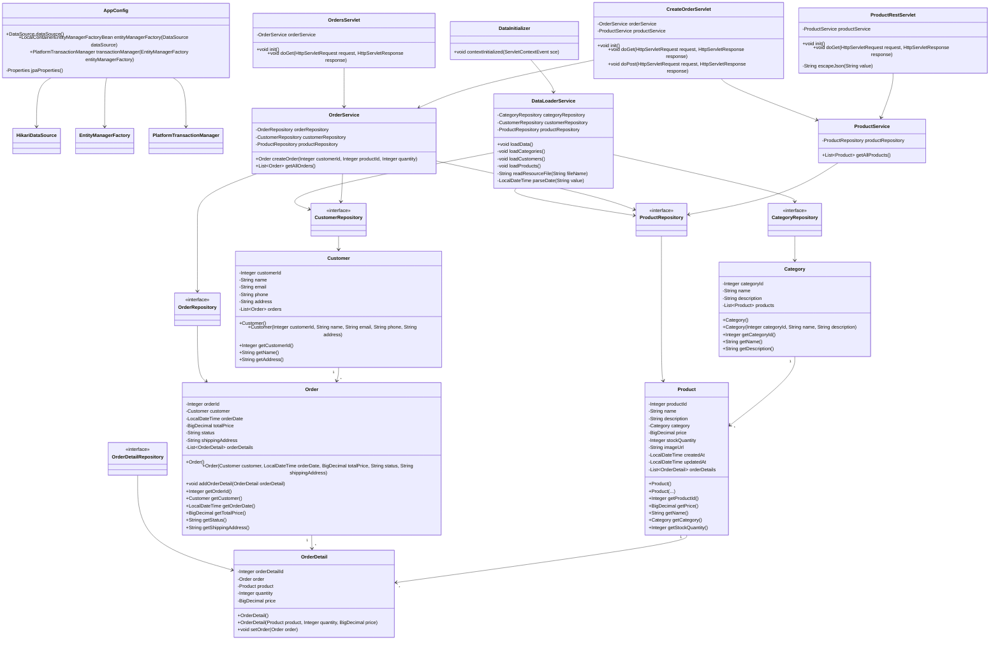

# Лабораторная работа 5. Разработка и развертывание Web-приложений

## Цель работы

Добавить Web-интерфейс к приложению магазина зоотоваров, настроить сборку проекта в WAR-файл, реализовать Java Servlet-страницы и REST-сервис, а также выполнить развертывание приложения на Apache Tomcat 11.

## Выполнение работы

В начале работы результат лабораторной работы №4 был скопирован в директорию:

```text
les10/lab
```

После этого проект был переделан под Web-приложение.  
Вместо запуска через `gradle run` приложение теперь собирается в WAR-файл и запускается на сервере Apache Tomcat 11.

## Настройка WAR-сборки

В файл:

```text
app/build.gradle.kts
```

был добавлен плагин:

```kotlin
plugins {
    java
    war
}
```

Также были добавлены зависимости для Web-приложения:

```kotlin
implementation("org.springframework:spring-web:6.2.2")
compileOnly("jakarta.servlet:jakarta.servlet-api:6.1.0")
```

Зависимость `jakarta.servlet-api` подключена как `compileOnly`, потому что реализация Servlet API уже находится внутри Apache Tomcat.

Сборка WAR-файла выполняется командой:

```bash
gradle war
```

После сборки WAR-файл создаётся в директории:

```text
app/build/libs
```

## Настройка web.xml

Для Web-приложения был создан файл:

```text
app/src/main/webapp/WEB-INF/web.xml
```

В нём подключается Spring `ContextLoaderListener`.

```xml
<listener>
    <listener-class>org.springframework.web.context.ContextLoaderListener</listener-class>
</listener>
```

Также указывается, что Spring должен использовать Java-конфигурацию:

```xml
<context-param>
    <param-name>contextClass</param-name>
    <param-value>org.springframework.web.context.support.AnnotationConfigWebApplicationContext</param-value>
</context-param>
```

И указывается конфигурационный класс приложения:

```xml
<context-param>
    <param-name>contextConfigLocation</param-name>
    <param-value>ru.bsuedu.cad.lab.config.AppConfig</param-value>
</context-param>
```

## Инициализация данных

Так как Web-приложение запускается сервером Tomcat, метод `main()` больше не используется как основная точка входа.

Для загрузки начальных данных был создан listener:

```text
DataInitializer
```

Он реализует интерфейс:

```java
ServletContextListener
```

При запуске Web-приложения `DataInitializer` получает Spring `WebApplicationContext`, достаёт из него `DataLoaderService` и загружает данные из CSV-файлов в базу данных.

Используемые CSV-файлы:

```text
category.csv
customer.csv
product.csv
```

## Реализованные сервлеты

В лабораторной работе были созданы три сервлета.

### OrdersServlet

Сервлет:

```text
OrdersServlet
```

URL:

```text
/orders
```

Он формирует HTML-страницу со списком заказов.

На странице отображаются:

- ID заказа;
- покупатель;
- дата заказа;
- сумма заказа;
- статус;
- адрес доставки.

Также на странице есть кнопка перехода к форме создания заказа.

### CreateOrderServlet

Сервлет:

```text
CreateOrderServlet
```

URL:

```text
/create-order
```

Метод `doGet()` формирует HTML-форму создания заказа.

Форма содержит:

- ID покупателя;
- список товаров;
- количество товара;
- кнопку создания заказа.

После отправки формы вызывается метод `doPost()`.

В `doPost()` данные формы передаются в `OrderService`, создаётся новый заказ, после чего пользователь перенаправляется на страницу:

```text
/orders
```

### ProductRestServlet

Сервлет:

```text
ProductRestServlet
```

URL:

```text
/api/products
```

Этот сервлет реализует REST-сервис для получения информации о продуктах.

Для каждого продукта выводятся:

- название продукта;
- название категории;
- количество на складе.

Ответ возвращается в формате JSON.

Пример ответа:

```json
[
  {
    "name": "Сухой корм для собак",
    "category": "Корма",
    "stockQuantity": 50
  }
]
```

## Получение Spring Bean внутри сервлета

Обычные сервлеты создаются Tomcat, а не Spring.  
Поэтому для получения Spring Bean внутри сервлета используется:

```java
WebApplicationContextUtils.getRequiredWebApplicationContext(getServletContext())
```

Пример:

```java
WebApplicationContext context =
        WebApplicationContextUtils.getRequiredWebApplicationContext(getServletContext());

orderService = context.getBean(OrderService.class);
```

Так сервлет может использовать сервисы Spring:

```text
OrderService
ProductService
DataLoaderService
```

## Проверка приложения

Приложение было собрано командой:

```bash
gradle war
```

После этого WAR-файл был развернут на Apache Tomcat 11.

Проверенные адреса:

```text
http://localhost:8080/app/orders
http://localhost:8080/app/create-order
http://localhost:8080/app/api/products
```

Страница `/orders` отображает список заказов.

Страница `/create-order` позволяет создать новый заказ.

После создания заказа происходит переход обратно на список заказов.

REST-сервис `/api/products` возвращает JSON со списком продуктов.

REST-сервис был проверен через Postman с помощью GET-запроса:

```text
GET http://localhost:8080/app/api/products
```

## UML-диаграмма классов



## Вывод

В ходе лабораторной работы приложение магазина зоотоваров было преобразовано в Web-приложение.

Была настроена сборка WAR-файла, добавлен `web.xml`, подключён Spring `ContextLoaderListener`, реализованы сервлеты для просмотра заказов, создания заказа и получения списка продуктов через REST-сервис.

Приложение было развернуто на Apache Tomcat 11. REST-сервис был успешно протестирован через Postman.