# Лабораторная работа 6. Разработка Web-приложений с использованием технологии Spring MVC

## Цель работы

Перевести Web-приложение магазина зоотоваров с обычных Java Servlet на Spring MVC.

В лабораторной работе необходимо настроить Spring MVC, реализовать REST API для работы с заказами, подключить шаблонизатор Thymeleaf и создать Web-интерфейс для просмотра, создания, изменения и удаления заказов.

## Выполнение работы

В начале работы результат лабораторной работы №5 был скопирован в директорию:

```text
les12/lab
```

После этого проект был переработан для использования Spring MVC.

В лабораторной работе были выполнены следующие действия:

1. Настроен `DispatcherServlet`.
2. Создана конфигурация Spring MVC.
3. Подключён Thymeleaf.
4. Реализован REST API для заказов.
5. Реализован Web-интерфейс для заказов.
6. Приложение собрано в WAR-файл.
7. Приложение развернуто на Apache Tomcat 11.
8. REST API протестирован через Postman.

## Настройка Spring MVC

Для работы со Spring MVC в проект была добавлена зависимость:

```kotlin
implementation("org.springframework:spring-webmvc:6.2.2")
```

Для работы с JSON была добавлена зависимость:

```kotlin
implementation("com.fasterxml.jackson.core:jackson-databind:2.17.2")
```

Для шаблонизатора Thymeleaf была добавлена зависимость:

```kotlin
implementation("org.thymeleaf:thymeleaf-spring6:3.1.2.RELEASE")
```

## Настройка DispatcherServlet

В файле:

```text
app/src/main/webapp/WEB-INF/web.xml
```

был настроен `DispatcherServlet`.

`DispatcherServlet` — это главный сервлет Spring MVC. Он принимает HTTP-запросы и передаёт их нужным контроллерам.

```xml
<servlet>
    <servlet-name>dispatcher</servlet-name>
    <servlet-class>org.springframework.web.servlet.DispatcherServlet</servlet-class>

    <init-param>
        <param-name>contextClass</param-name>
        <param-value>org.springframework.web.context.support.AnnotationConfigWebApplicationContext</param-value>
    </init-param>

    <init-param>
        <param-name>contextConfigLocation</param-name>
        <param-value>ru.bsuedu.cad.lab.config.WebConfig</param-value>
    </init-param>

    <load-on-startup>1</load-on-startup>
</servlet>

<servlet-mapping>
    <servlet-name>dispatcher</servlet-name>
    <url-pattern>/</url-pattern>
</servlet-mapping>
```

Также в `web.xml` остался `ContextLoaderListener`, который создаёт основной Spring-контекст приложения.

## Конфигурация WebConfig

Для настройки Spring MVC был создан класс:

```text
ru.bsuedu.cad.lab.config.WebConfig
```

В нём используются аннотации:

```java
@Configuration
@EnableWebMvc
@ComponentScan(basePackages = "ru.bsuedu.cad.lab.controller")
```

`@EnableWebMvc` включает поддержку Spring MVC.

`@ComponentScan` указывает, где искать контроллеры.

Также в `WebConfig` настроен Thymeleaf:

```java
resolver.setPrefix("/WEB-INF/templates/");
resolver.setSuffix(".html");
resolver.setTemplateMode("HTML");
resolver.setCharacterEncoding("UTF-8");
```

Это значит, что если контроллер возвращает:

```java
return "orders";
```

то Spring MVC откроет шаблон:

```text
/WEB-INF/templates/orders.html
```

## REST API для заказов

Для REST API был создан контроллер:

```text
OrderRestController
```

Он расположен в пакете:

```text
ru.bsuedu.cad.lab.controller
```

Контроллер помечен аннотацией:

```java
@RestController
@RequestMapping("/api/orders")
```

Были реализованы следующие REST-запросы:

```text
GET    /api/orders       - получить список заказов
GET    /api/orders/{id}  - получить заказ по идентификатору
POST   /api/orders       - создать заказ
PUT    /api/orders/{id}  - изменить заказ
DELETE /api/orders/{id}  - удалить заказ
```

Для передачи данных использовались DTO-классы:

```text
CreateOrderRequest
UpdateOrderRequest
OrderResponse
```

DTO нужны для того, чтобы REST API возвращал удобные JSON-объекты, а не JPA-сущности напрямую.

## Примеры REST-запросов

### Получить список заказов

```http
GET http://localhost:8080/app/api/orders
```

### Получить заказ по ID

```http
GET http://localhost:8080/app/api/orders/1
```

### Создать заказ

```http
POST http://localhost:8080/app/api/orders
Content-Type: application/json
```

Тело запроса:

```json
{
  "customerId": 1,
  "productId": 1,
  "quantity": 2
}
```

### Изменить заказ

```http
PUT http://localhost:8080/app/api/orders/1
Content-Type: application/json
```

Тело запроса:

```json
{
  "status": "PAID",
  "shippingAddress": "Новый адрес доставки"
}
```

### Удалить заказ

```http
DELETE http://localhost:8080/app/api/orders/1
```

REST API был протестирован через Postman.

## Web-интерфейс на Thymeleaf

Для Web-интерфейса был создан контроллер:

```text
OrderWebController
```

Он помечен аннотацией:

```java
@Controller
@RequestMapping("/orders")
```

В отличие от `@RestController`, обычный `@Controller` возвращает не JSON, а имя HTML-шаблона.

## Реализованные страницы

### Список заказов

Адрес:

```text
http://localhost:8080/app/orders
```

Шаблон:

```text
orders.html
```

Страница показывает таблицу заказов.

Для каждого заказа выводятся:

- ID заказа;
- покупатель;
- дата заказа;
- сумма;
- статус;
- адрес доставки.

Также на странице есть кнопки:

- создать заказ;
- изменить заказ;
- удалить заказ.

### Создание заказа

Адрес:

```text
http://localhost:8080/app/orders/new
```

Шаблон:

```text
order-form.html
```

Форма позволяет указать:

- ID покупателя;
- товар;
- количество.

После отправки формы создаётся новый заказ, и пользователь возвращается на страницу списка заказов.

### Изменение заказа

Адрес:

```text
http://localhost:8080/app/orders/{id}/edit
```

Шаблон:

```text
order-edit.html
```

Форма позволяет изменить:

- статус заказа;
- адрес доставки.

После сохранения пользователь возвращается к списку заказов.

### Удаление заказа

Удаление выполняется через POST-запрос:

```text
/orders/{id}/delete
```

После удаления пользователь возвращается на страницу списка заказов.

## Сервисный слой

Для работы с заказами используется сервис:

```text
OrderService
```

В лабораторной работе он был дополнен методами:

```java
getAllOrders()
getOrderById(Integer orderId)
createOrder(Integer customerId, Integer productId, Integer quantity)
updateOrder(Integer orderId, String status, String shippingAddress)
deleteOrder(Integer orderId)
```

Методы создания, изменения и удаления заказа выполняются в транзакции с помощью аннотации:

```java
@Transactional
```

## Инициализация данных

Для загрузки начальных данных используется класс:

```text
DataInitializer
```

Он запускается при старте Web-приложения и вызывает:

```java
dataLoaderService.loadData();
```

Данные загружаются из CSV-файлов:

```text
category.csv
customer.csv
product.csv
```

## Структура проекта

Основной код расположен по пути:

```text
app/src/main/java/ru/bsuedu/cad/lab
```

Структура пакетов:

```text
app
config
controller
dto
entity
repository
service
```

Назначение пакетов:

```text
app        - инициализация данных при запуске приложения
config     - конфигурация Spring, JPA и Spring MVC
controller - Spring MVC и REST-контроллеры
dto        - классы передачи данных для REST API
entity     - JPA-сущности
repository - Spring Data JPA репозитории
service    - бизнес-логика приложения
```

Шаблоны Thymeleaf находятся по пути:

```text
app/src/main/webapp/WEB-INF/templates
```

Список шаблонов:

```text
orders.html
order-form.html
order-edit.html
```

## Сборка и деплой

Приложение собирается командой:

```bash
gradle war
```

WAR-файл создаётся в директории:

```text
app/build/libs
```

После сборки WAR-файл был развернут на Apache Tomcat 11.

Проверенные адреса:

```text
http://localhost:8080/app/orders
http://localhost:8080/app/orders/new
http://localhost:8080/app/api/orders
```

## UML-диаграмма классов

```mermaid
classDiagram
    AppConfig --> HikariDataSource
    AppConfig --> EntityManagerFactory
    AppConfig --> PlatformTransactionManager

    WebConfig --> ThymeleafViewResolver
    WebConfig --> SpringTemplateEngine
    WebConfig --> SpringResourceTemplateResolver

    DataInitializer --> DataLoaderService

    OrderRestController --> OrderService
    OrderRestController --> CreateOrderRequest
    OrderRestController --> UpdateOrderRequest
    OrderRestController --> OrderResponse

    OrderWebController --> OrderService
    OrderWebController --> ProductService

    DataLoaderService --> CategoryRepository
    DataLoaderService --> CustomerRepository
    DataLoaderService --> ProductRepository

    OrderService --> OrderRepository
    OrderService --> CustomerRepository
    OrderService --> ProductRepository

    ProductService --> ProductRepository

    CategoryRepository --> Category
    ProductRepository --> Product
    CustomerRepository --> Customer
    OrderRepository --> Order
    OrderDetailRepository --> OrderDetail

    Category "1" --> "*" Product
    Customer "1" --> "*" Order
    Order "1" --> "*" OrderDetail
    Product "1" --> "*" OrderDetail

    class AppConfig {
        +DataSource dataSource()
        +LocalContainerEntityManagerFactoryBean entityManagerFactory(DataSource dataSource)
        +PlatformTransactionManager transactionManager(EntityManagerFactory entityManagerFactory)
        -Properties jpaProperties()
    }

    class WebConfig {
        +SpringResourceTemplateResolver templateResolver()
        +SpringTemplateEngine templateEngine()
        +ThymeleafViewResolver viewResolver()
    }

    class DataInitializer {
        +void contextInitialized(ServletContextEvent sce)
    }

    class OrderRestController {
        -OrderService orderService
        +List~OrderResponse~ getAllOrders()
        +OrderResponse getOrderById(Integer id)
        +OrderResponse createOrder(CreateOrderRequest request)
        +OrderResponse updateOrder(Integer id, UpdateOrderRequest request)
        +void deleteOrder(Integer id)
    }

    class OrderWebController {
        -OrderService orderService
        -ProductService productService
        +String orders(Model model)
        +String newOrderForm(Model model)
        +String createOrder(Integer customerId, Integer productId, Integer quantity)
        +String editOrderForm(Integer id, Model model)
        +String updateOrder(Integer id, String status, String shippingAddress)
        +String deleteOrder(Integer id)
    }

    class CreateOrderRequest {
        -Integer customerId
        -Integer productId
        -Integer quantity
        +Integer getCustomerId()
        +Integer getProductId()
        +Integer getQuantity()
    }

    class UpdateOrderRequest {
        -String status
        -String shippingAddress
        +String getStatus()
        +String getShippingAddress()
    }

    class OrderResponse {
        -Integer orderId
        -String customerName
        -LocalDateTime orderDate
        -BigDecimal totalPrice
        -String status
        -String shippingAddress
        +OrderResponse(Order order)
        +Integer getOrderId()
        +String getCustomerName()
        +LocalDateTime getOrderDate()
        +BigDecimal getTotalPrice()
        +String getStatus()
        +String getShippingAddress()
    }

    class Category {
        -Integer categoryId
        -String name
        -String description
        -List~Product~ products
    }

    class Product {
        -Integer productId
        -String name
        -String description
        -Category category
        -BigDecimal price
        -Integer stockQuantity
        -String imageUrl
        -LocalDateTime createdAt
        -LocalDateTime updatedAt
        -List~OrderDetail~ orderDetails
    }

    class Customer {
        -Integer customerId
        -String name
        -String email
        -String phone
        -String address
        -List~Order~ orders
    }

    class Order {
        -Integer orderId
        -Customer customer
        -LocalDateTime orderDate
        -BigDecimal totalPrice
        -String status
        -String shippingAddress
        -List~OrderDetail~ orderDetails
        +void addOrderDetail(OrderDetail orderDetail)
        +void setStatus(String status)
        +void setShippingAddress(String shippingAddress)
    }

    class OrderDetail {
        -Integer orderDetailId
        -Order order
        -Product product
        -Integer quantity
        -BigDecimal price
        +void setOrder(Order order)
    }

    class DataLoaderService {
        -CategoryRepository categoryRepository
        -CustomerRepository customerRepository
        -ProductRepository productRepository
        +void loadData()
    }

    class OrderService {
        -OrderRepository orderRepository
        -CustomerRepository customerRepository
        -ProductRepository productRepository
        +Order createOrder(Integer customerId, Integer productId, Integer quantity)
        +List~Order~ getAllOrders()
        +Order getOrderById(Integer orderId)
        +Order updateOrder(Integer orderId, String status, String shippingAddress)
        +void deleteOrder(Integer orderId)
    }

    class ProductService {
        -ProductRepository productRepository
        +List~Product~ getAllProducts()
    }

    class CategoryRepository {
        <<interface>>
    }

    class ProductRepository {
        <<interface>>
    }

    class CustomerRepository {
        <<interface>>
    }

    class OrderRepository {
        <<interface>>
    }

    class OrderDetailRepository {
        <<interface>>
    }
```




## Вывод

В результате выполнения лабораторной работы приложение было переведено с обычных сервлетов на Spring MVC.

Был настроен `DispatcherServlet`, создана MVC-конфигурация, подключён Thymeleaf и реализованы контроллеры для REST API и Web-интерфейса.

REST API позволяет получать, создавать, изменять и удалять заказы. Web-интерфейс позволяет выполнять те же действия через HTML-страницы.

Приложение успешно собирается командой:

```bash
gradle war
```

и разворачивается на Apache Tomcat 11.